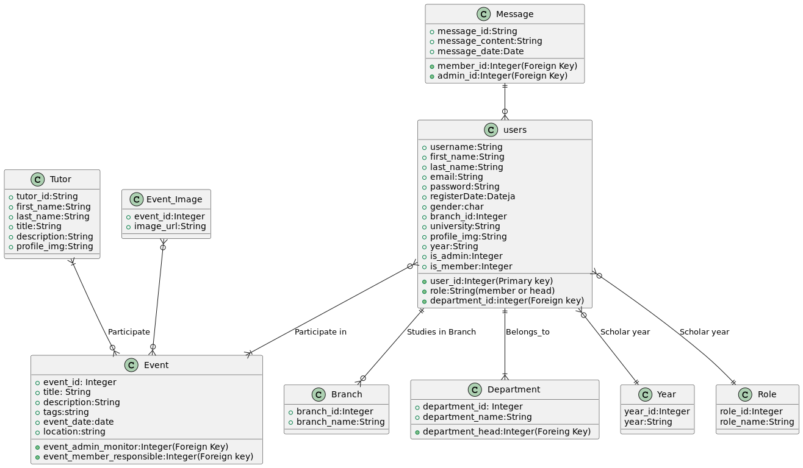

# **Skill&Tell:**

This Project uses the combination of ***Laravel*** & ***React:*** 

<p align="center"><a href="https://laravel.com" target="_blank"></a></p>
<p align="center"></p>


## **Database Schema:**

This schema includes and elaborates all the database general structure.



## **Creating the Table *Users:***

The table users, is the main Table for ***all Users.***

```sql
--
-- Table structure for table `users`
--

DROP TABLE IF EXISTS `users`;
CREATE TABLE `users` (
  `id` bigint UNSIGNED NOT NULL,
  `username` varchar(255) COLLATE utf8mb4_unicode_ci NOT NULL,
  `first_name` varchar(255) COLLATE utf8mb4_unicode_ci NOT NULL,
  `last_name` varchar(255) COLLATE utf8mb4_unicode_ci NOT NULL,
  `email` varchar(255) COLLATE utf8mb4_unicode_ci NOT NULL,
  `password` varchar(255) COLLATE utf8mb4_unicode_ci NOT NULL,
  `created_at` timestamp NULL DEFAULT NULL,
  `updated_at` timestamp NULL DEFAULT NULL,
  `email_verified_at` timestamp NULL DEFAULT NULL,
  `remember_token` varchar(100) COLLATE utf8mb4_unicode_ci DEFAULT NULL,
  `profile_img` varchar(255) COLLATE utf8mb4_unicode_ci DEFAULT NULL,
  `gender` char(255) COLLATE utf8mb4_unicode_ci NOT NULL,
  `branch_id` bigint UNSIGNED NOT NULL,
  `university` varchar(255) COLLATE utf8mb4_unicode_ci NOT NULL,
  `year_id` bigint UNSIGNED NOT NULL,
  `is_member` tinyint(1) NOT NULL,
  `is_admin` tinyint(1) NOT NULL,
  `role_id` bigint UNSIGNED NOT NULL,
  `department_id` bigint UNSIGNED NOT NULL
) ENGINE=InnoDB DEFAULT CHARSET=utf8mb4 COLLATE=utf8mb4_unicode_ci;
```

<!--  -->

## **Creating the Table *Roles:***

This table defines all the roles assigned to any member of the Club, including non-members with the Role **External**.

```sql
--
-- Table structure for table `roles`
--

DROP TABLE IF EXISTS `roles`;
CREATE TABLE `roles` (
  `id` bigint UNSIGNED NOT NULL,
  `created_at` timestamp NULL DEFAULT NULL,
  `updated_at` timestamp NULL DEFAULT NULL,
  `name` varchar(255) COLLATE utf8mb4_unicode_ci NOT NULL
) ENGINE=InnoDB DEFAULT CHARSET=utf8mb4 COLLATE=utf8mb4_unicode_ci;```


## **Creating the Table *Years:**

The table ***Years:***

This table defines the current year of each student, for example for the moment we have *1st Years Students*
& *2nd Year Students.*

```sql
DROP TABLE IF EXISTS `years`;
CREATE TABLE `years` (
  `id` bigint UNSIGNED NOT NULL,
  `name` varchar(255) COLLATE utf8mb4_unicode_ci NOT NULL,
  `created_at` timestamp NULL DEFAULT NULL,
  `updated_at` timestamp NULL DEFAULT NULL
) ENGINE=InnoDB DEFAULT CHARSET=utf8mb4 COLLATE=utf8mb4_unicode_ci;

```

<!--  -->

## **Creating the Table *Tutors:***

This table defines

```sql
--
-- Table structure for table `tutors`
--

DROP TABLE IF EXISTS `tutors`;
CREATE TABLE `tutors` (
  `id` bigint UNSIGNED NOT NULL,
  `created_at` timestamp NULL DEFAULT NULL,
  `updated_at` timestamp NULL DEFAULT NULL,
  `first_name` varchar(255) COLLATE utf8mb4_unicode_ci NOT NULL,
  `last_name` varchar(255) COLLATE utf8mb4_unicode_ci NOT NULL,
  `title` varchar(255) COLLATE utf8mb4_unicode_ci NOT NULL,
  `description` varchar(255) COLLATE utf8mb4_unicode_ci NOT NULL,
  `profile_img` varchar(255) COLLATE utf8mb4_unicode_ci DEFAULT NULL
) ENGINE=InnoDB DEFAULT CHARSET=utf8mb4 COLLATE=utf8mb4_unicode_ci;
```

## **Creating the Table *Events:***

This table contains all the Club's Events:


```sql
--
-- Table structure for table `events`
--

DROP TABLE IF EXISTS `events`;
CREATE TABLE `events` (
  `id` bigint UNSIGNED NOT NULL,
  `created_at` timestamp NULL DEFAULT NULL,
  `updated_at` timestamp NULL DEFAULT NULL,
  `title` varchar(255) COLLATE utf8mb4_unicode_ci NOT NULL,
  `description` varchar(255) COLLATE utf8mb4_unicode_ci NOT NULL,
  `tages` varchar(255) COLLATE utf8mb4_unicode_ci NOT NULL,
  `date` date NOT NULL,
  `location` varchar(255) COLLATE utf8mb4_unicode_ci NOT NULL,
  `monitor_id` bigint UNSIGNED NOT NULL,
  `responsible_id` bigint UNSIGNED NOT NULL
) ENGINE=InnoDB DEFAULT CHARSET=utf8mb4 COLLATE=utf8mb4_unicode_ci;
```


## **Creating the Table *Messages:***

This table stores all the messages sent in the chat app provided in the WebApp.


```sql
--
-- Table structure for table `messages`
--

DROP TABLE IF EXISTS `messages`;
CREATE TABLE `messages` (
  `id` bigint UNSIGNED NOT NULL,
  `created_at` timestamp NULL DEFAULT NULL,
  `updated_at` timestamp NULL DEFAULT NULL,
  `content` varchar(255) COLLATE utf8mb4_unicode_ci NOT NULL,
  `sender_id` bigint UNSIGNED NOT NULL
) ENGINE=InnoDB DEFAULT CHARSET=utf8mb4 COLLATE=utf8mb4_unicode_ci;
```


## **Creating the Table *Branches:***

This table include the study field of each student:


```sql
--
-- Table structure for table `branches`
--

DROP TABLE IF EXISTS `branches`;
CREATE TABLE `branches` (
  `id` bigint UNSIGNED NOT NULL,
  `created_at` timestamp NULL DEFAULT NULL,
  `updated_at` timestamp NULL DEFAULT NULL,
  `name` varchar(255) COLLATE utf8mb4_unicode_ci NOT NULL
) ENGINE=InnoDB DEFAULT CHARSET=utf8mb4 COLLATE=utf8mb4_unicode_ci;
```


## **Creating the Table *Departements:***

This table include the avaialble Club departement:


```sql
--
-- Table structure for table `departments`
--

DROP TABLE IF EXISTS `departments`;
CREATE TABLE `departments` (
  `id` bigint UNSIGNED NOT NULL,
  `created_at` timestamp NULL DEFAULT NULL,
  `updated_at` timestamp NULL DEFAULT NULL,
  `name` varchar(255) COLLATE utf8mb4_unicode_ci NOT NULL,
  `head_id` bigint UNSIGNED NOT NULL
) ENGINE=InnoDB DEFAULT CHARSET=utf8mb4 COLLATE=utf8mb4_unicode_ci;

```


## **Creating the Table *Migrations:***

This is a table automatically generated by **Laravel** to keep track of the executed migrations:


```sql
--
-- Table structure for table `migrations`
--

DROP TABLE IF EXISTS `migrations`;
CREATE TABLE `migrations` (
  `id` int UNSIGNED NOT NULL,
  `migration` varchar(255) COLLATE utf8mb4_unicode_ci NOT NULL,
  `batch` int NOT NULL
) ENGINE=InnoDB DEFAULT CHARSET=utf8mb4 COLLATE=utf8mb4_unicode_ci;

```


## **Creating the Table *Event Images:***

This table stores all the images for any event:

```sql
--
-- Table structure for table `event_images`
--

DROP TABLE IF EXISTS `event_images`;
CREATE TABLE `event_images` (
  `event_id` bigint UNSIGNED NOT NULL,
  `image_url` varchar(255) COLLATE utf8mb4_unicode_ci NOT NULL
) ENGINE=InnoDB DEFAULT CHARSET=utf8mb4 COLLATE=utf8mb4_unicode_ci;

```


<!--  -->

## **Creating the Table *Event Tutors:***

This table stores all the event tutors:

```sql

--
-- Table structure for table `tutors`
--

DROP TABLE IF EXISTS `tutors`;
CREATE TABLE `tutors` (
  `id` bigint UNSIGNED NOT NULL,
  `created_at` timestamp NULL DEFAULT NULL,
  `updated_at` timestamp NULL DEFAULT NULL,
  `first_name` varchar(255) COLLATE utf8mb4_unicode_ci NOT NULL,
  `last_name` varchar(255) COLLATE utf8mb4_unicode_ci NOT NULL,
  `title` varchar(255) COLLATE utf8mb4_unicode_ci NOT NULL,
  `description` varchar(255) COLLATE utf8mb4_unicode_ci NOT NULL,
  `profile_img` varchar(255) COLLATE utf8mb4_unicode_ci DEFAULT NULL
) ENGINE=InnoDB DEFAULT CHARSET=utf8mb4 COLLATE=utf8mb4_unicode_ci;

```


## **Creating the Table *Event Users:***

This table stores the users participated in a given event:

```sql
--
-- Table structure for table `event_users`
--

DROP TABLE IF EXISTS `event_users`;
CREATE TABLE `event_users` (
  `user_id` bigint UNSIGNED NOT NULL,
  `event_id` bigint UNSIGNED NOT NULL
) ENGINE=InnoDB DEFAULT CHARSET=utf8mb4 COLLATE=utf8mb4_unicode_ci;
```